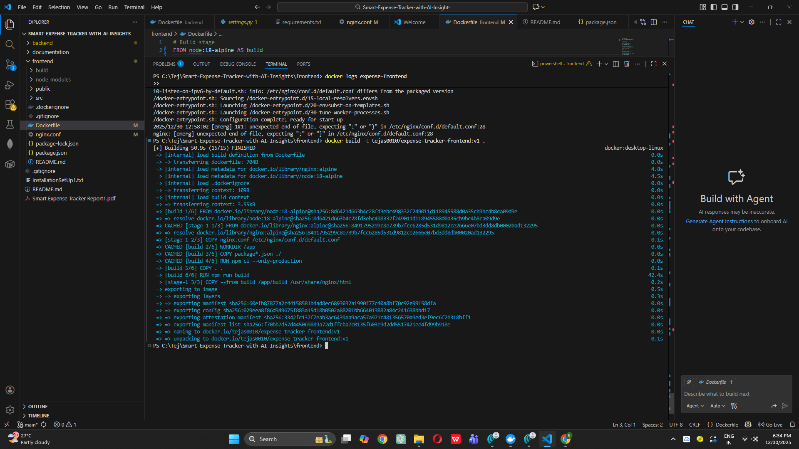
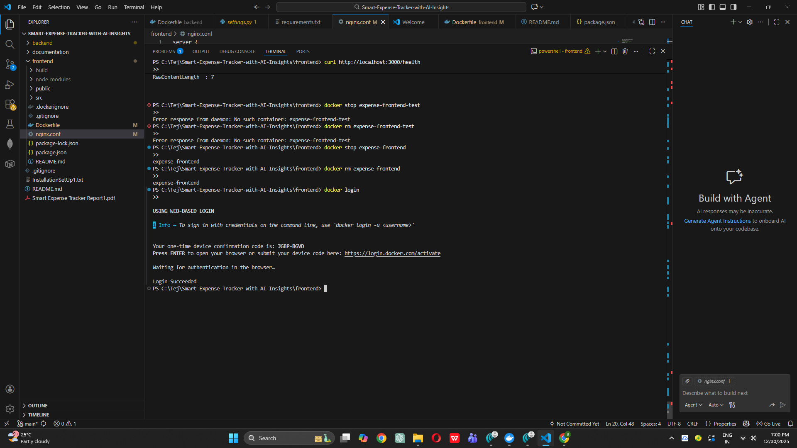
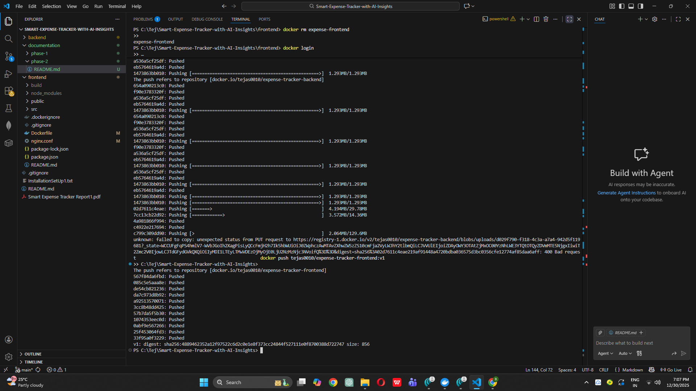

# Phase 2: Docker Multi-Stage Builds

## 🎯 Objective
Create optimized Docker containers for Django backend and React frontend using multi-stage builds.

## ✅ What Was Accomplished

### Backend Dockerization
- ✅ Created multi-stage Dockerfile with Python 3.11-slim
- ✅ Implemented builder pattern to minimize image size
- ✅ Added non-root user (appuser) for security
- ✅ Configured health check endpoint
- ✅ Set up Gunicorn for production server
- ✅ Built and tested backend container locally
- ✅ Pushed image to Docker Hub

### Frontend Dockerization
- ✅ Created multi-stage Dockerfile with Node.js 18 + NGINX
- ✅ Optimized React build process
- ✅ Configured NGINX for serving static files and API proxy
- ✅ Implemented health check endpoint
- ✅ Built and tested frontend container locally
- ✅ Pushed image to Docker Hub

## 📦 Docker Images Created

| Image | Tag | Size | Purpose |
|-------|-----|------|---------|
| expense-tracker-backend | v1 | ~XXX MB | Django API server |
| expense-tracker-frontend | v1 | ~XXX MB | React + NGINX |

## 🖼️ Screenshots

### Backend Build Success

*Backend Docker image built successfully with multi-stage optimization*

### Frontend Build Success

*Frontend Docker image built with React production build and NGINX*

### Docker Hub Login

*Successfully authenticated with Docker Hub*

### Images Pushed to Docker Hub

*Both backend and frontend images pushed to Docker Hub registry*

## 🔧 Key Configuration Files

### Backend Dockerfile Highlights
```dockerfile
# Multi-stage build
FROM python:3.11-slim as builder
# ... dependencies installation

FROM python:3.11-slim  # Smaller runtime image
# ... copy from builder
USER appuser  # Non-root user
HEALTHCHECK ...  # Kubernetes-ready
```

### Frontend Dockerfile Highlights
```dockerfile
FROM node:18-alpine as builder
# ... React build

FROM nginx:alpine  # Lightweight runtime
# ... NGINX configuration
HEALTHCHECK ...  # Kubernetes-ready
```

### NGINX Configuration
- ✅ React Router support (try_files)
- ✅ API proxy to backend
- ✅ Gzip compression
- ✅ Health check endpoint

## 📊 Testing Results

### Backend Container Test
```bash
✅ Container started successfully
✅ Health endpoint responding: {"status":"healthy"}
✅ API accessible on port 8000
```

### Frontend Container Test
```bash
✅ Container started successfully
✅ Health endpoint responding: "healthy"
✅ Static files served correctly on port 80
✅ React app loads in browser
```

## 🚀 Commands Used

### Build Commands
```bash
# Backend
docker build -t your-dockerhub-username/expense-tracker-backend:v1 ./backend

# Frontend
docker build -t your-dockerhub-username/expense-tracker-frontend:v1 ./frontend
```

### Test Commands
```bash
# Test backend
docker run -d -p 8000:8000 -e DEBUG=True your-dockerhub-username/expense-tracker-backend:v1
curl http://localhost:8000/health

# Test frontend
docker run -d -p 3000:80 your-dockerhub-username/expense-tracker-frontend:v1
curl http://localhost:3000/health
```

### Push Commands
```bash
docker login
docker push your-dockerhub-username/expense-tracker-backend:v1
docker push your-dockerhub-username/expense-tracker-frontend:v1
```

## 📋 Summary

**Phase 2 Complete!**

Accomplished:
1. ✅ Created optimized multi-stage Dockerfiles
2. ✅ Implemented security best practices (non-root users)
3. ✅ Added health checks for container orchestration
4. ✅ Tested containers locally
5. ✅ Pushed images to Docker Hub registry

**Docker Images Status:** ✅ Ready for Kubernetes deployment

**Next Phase:** Phase 3 - Kubernetes Manifests & EKS Setup

---

*Phase 2 completed on: [DATE]*
*Images available at: https://hub.docker.com/u/your-dockerhub-username*